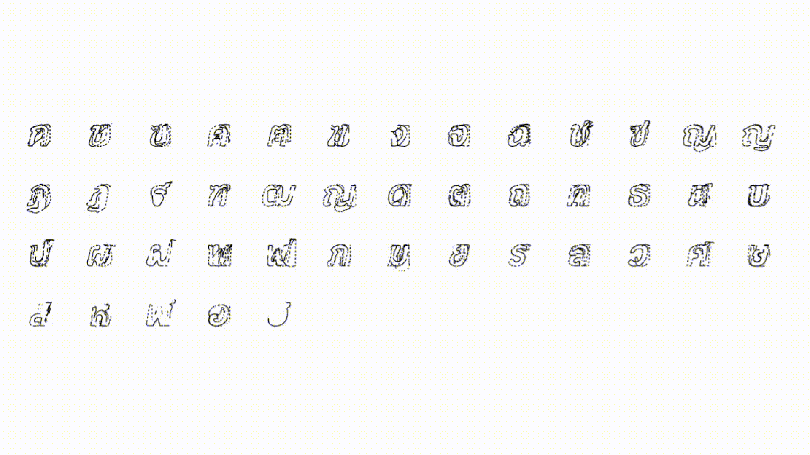

# ThaiVecFont

This is the official pytorch implementation of:

[DeepVecFont-v2: Exploiting Transformers to Synthesize Vector Fonts with Higher Quality. CVPR 2023.](https://arxiv.org/abs/2303.14585) 

In Thai Font Version

### Font Dataset
- **[Preprocessed Dataset (THA)](https://drive.google.com/file/d/1-JuWkDZprqp-TzTwx3xf33nKccI-prpp/view?usp=sharing)**
- **[TTF Fonts](https://drive.google.com/file/d/1UigG2bWRfAv2VelN8uwjw6FQMteXtLv5/view?usp=sharing)**

These Thai Fonts dataset are collected by ThaiFaces from many sources like Google Fonts, F0nt.com, Fontcraft.com, etc., and other individual personal designers. Many fonts have a non-commercial license.

My work is for educational purposes. You can ONLY use this dataset for non-commercial purposes and CANNOT use this dataset and pretrained model for any commercial purposes. Using this dataset for commercial purposes may violate the principles of intellectual property.

### Blog
You can read about this work here in this blog, where I explained about my project progression.
[Medium Blog Post](https://medium.com/@guntee12123/synthesize-high-quality-thai-vector-fonts-with-deepvecfont-v2-a123317e1910)

### Acknowledgment

- [SVG-VAE](https://github.com/magenta/magenta/tree/main/magenta/models/svg_vae)
- [DeepVecFont](https://github.com/yizhiwang96/deepvecfont)

